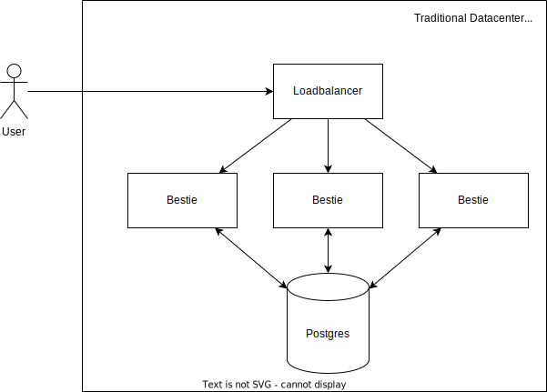
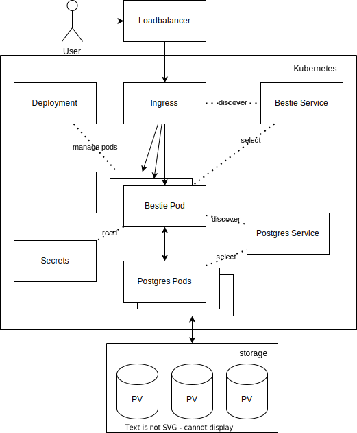

# L5 Demo Operator 🏗️

The projects goal is to develop a demo operator with level 5 capabilities to serve as an example to enhance workshop [(internal)](https://drive.google.com/drive/u/0/folders/1l6FY1QdBq1IsmwM6Ib44A8h12OSKGJbe) as well as to present at kubecon or a similar conference for which a [proposal](https://drive.google.com/file/d/1GjJgBcJmywP3L64m1h4vZ68UIu-XJxMZ/view?usp=sharing) was submitted. One version of the [(presentation)](https://opdev.github.io/l5-operator-demo/) was accepted to [(cloud native rejects)](https://cfp.cloud-native.rejekts.io/cloud-native-rejekts-eu-valencia-2022/talk/review/LESBCQ3MJQFEE3JWMRCJKKL9XT7YMDHP). The capabilities are being developed according to our interpretation of the requirements described by the operator capability descriptions given in the operator sdk which are currently being evolved [working in progress](https://docs.google.com/document/d/1gNa2NQzlsHDdNHBYPczCytkuokEzBCFKjlxM12X5cdk/edit?usp=sharing)

## Current Capability descriptions
The l5 operator is an example of a minimal implementation of the 5 capability levels described by the operator framework

### Level 1: Basic Install
The L5 operator is able to take advantage of the Operator Lifecycle Manager and is able to deployed with one click. Once deployed it is able to set up its operator upon creation of a custom resource.

### Level 2: Seamless Upgrades
Its possible to rollout both operator and operand updates seamless with some caveats.

### Level 3: Full Lifecycle
Backup and restore functionality is provided via the postgres operator which we consume in order to get a database-as-a-service right within our cluster

### Level 4: Deep Insights
The operator as well as operand expose metrics. These are aggregated using prometheus and visualized using grafana.

### Level 5: Autopilot
The operator is able to autoscale by automatically provisioning a horizontal pod autoscaler that automatically changes the size of the deployment based on application load.

# Operator Installation
The operator is published as a community operator on the openshift operator hub.

## Different ways to run the Operator using the Operator SDK

### Prerequisites
- When not using OLM to install the L5 Operator, the Crunchy Data Postgres Operator needs to be installed either from the operator hub when using Openshift or [manually](https://access.crunchydata.com/documentation/postgres-operator/v5/quickstart/)
- The L5 Operator requires an ingress controller to be installed if running on vanilla kubernetes if not already present. Steps for installing ingress controller for different clusters can be followed from [here](https://kubernetes.github.io/ingress-nginx/deploy/)

### 1. Run locally outside the cluster
```
git clone https://github.com/opdev/l5-operator-demo
```

``` 
cd <project>
```

``` 
make generate
```

``` 
make manifests
```

``` 
make install
```

``` 
make run
```

``` 
oc apply -f config/samples/pets_v1_bestie.yaml
```

### 2. Run as a Deployment inside the cluster
``` 
git clone https://github.com/opdev/l5-operator-demo
```

``` 
cd <project>
```

``` 
make generate
```

``` 
make manifests
```

- Build and push your image to the location specified by IMG:
``` 
make docker-build docker-push IMG=<some-registry>/<project-name>:tag 
```

- Deploy the controller to the cluster with image specified by IMG:
``` 
make deploy IMG=<some-registry>/<project-name>:tag
```

### 3. Deploy the Operator with OLM
```
operator-sdk run bundle <operator-bundle-image>
```

# High Level Diagrams

An editable version of this diagram is on google drive via [draw.io](https://drive.google.com/file/d/1zwZDZyp_OqdqhPicXgfqIDRPZB4IYjwO/view?usp=sharing)


## "Traditional" Architecture



## What it looks like in Kubernetes


